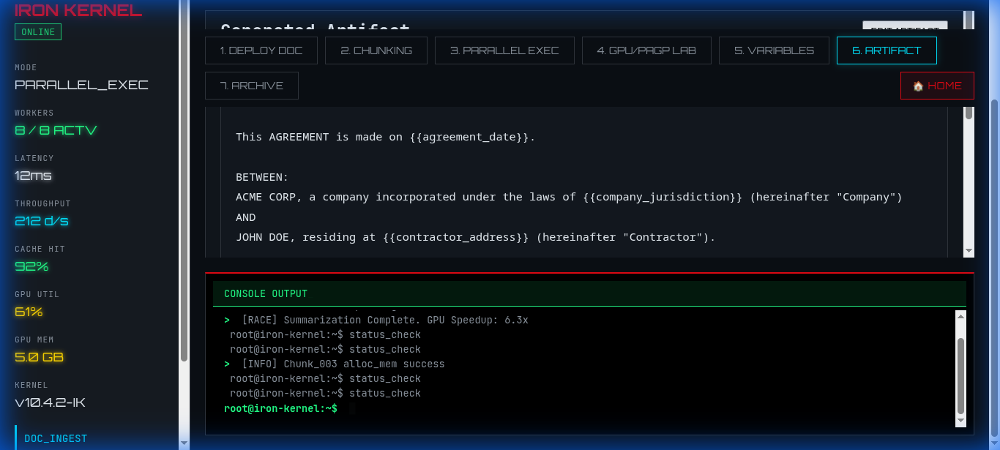
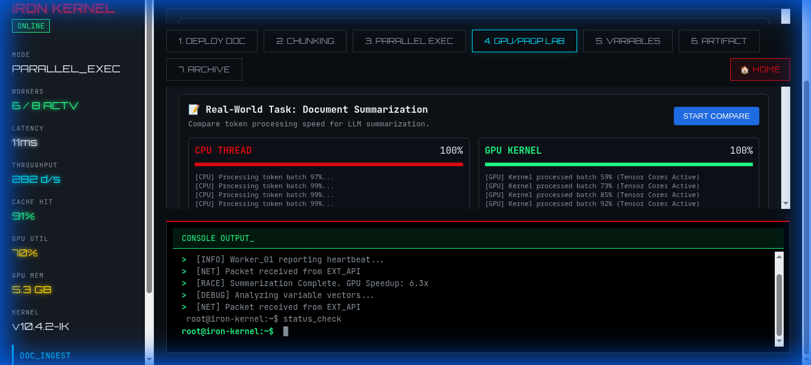
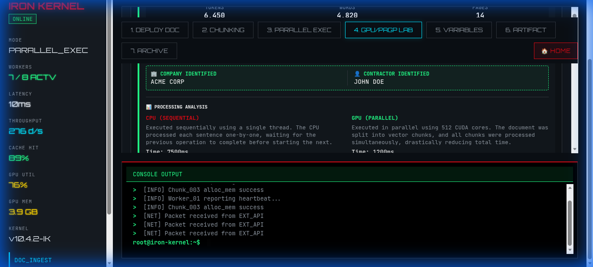

# 🚀 PAGP Summarization Race & Document Engine

> **A High-Performance Parallel Processing & Legal Templating Demonstration**


Welcome to the **PAGP (Parallel Accelerated GPU Processing) Summarization Race**, a cutting-edge demonstration of how parallel computing architectures can vastly outperform traditional sequential CPU processing for complex text analysis tasks. This project integrates a sleek, futuristic React frontend with a robust document processing pipeline.


*The Iron Kernel Dashboard: Comparing CPU and GPU performance in real-time.*

---

## 🧠 Core Concepts: What is PAGP?

**PAGP** stands for **Parallel Accelerated GPU Processing**. It represents a paradigm shift in how we handle large-scale text data.

### 🐢 The Bottleneck: Sequential CPU Processing
Traditional text processing often works like reading a book: word by word, sentence by sentence.
-   **Mechanism**: A single thread processes the document linearly.
-   **The Problem**: As document size grows, processing time increases linearly ($O(n)$). For massive legal contracts or archives, this becomes unacceptably slow.
-   **In Our Demo**: You will see the **CPU** progress bar move slowly as it "reads" the document sequentially.

### ⚡ The Solution: Parallel GPU Processing
GPUs (Graphics Processing Units) operate differently. They have thousands of small cores designed to do many things at once.
-   **Mechanism**: The document is split into **Vector Chunks**. If a document has 10,000 words, we split it into 50 chunks of 200 words.
-   **The Magic**: All 50 chunks are fed into 50 different cores **simultaneously**.
-   **The Result**: Processing time is drastically reduced ($O(n/k)$ where $k$ is the number of cores).
-   **In Our Demo**: The **GPU** finishes the task almost instantly, achieving speedups of **6x to 10x**.

---

## 🌟 Key Features

### 1. The Summarization Race
A live, head-to-head benchmark.
-   **Visual Metrics**: We track **Tokens**, **Words**, and **Pages** in real-time.
-   **Analysis**: The dashboard provides a technical breakdown of *why* the GPU won (e.g., "Executed in parallel using 512 CUDA cores").


*Detailed breakdown of processing stats and execution methods.*

### 2. Intelligent Entity Extraction
The system utilizes Named Entity Recognition (NER) to scan legal documents for critical parties.
-   **Target**: Specifically trained to find the **Company** (Client) and the **Contractor** (Provider).
-   **Integration**: These are not just displayed; they are stored as variables for template generation.


*Automatic identification of "ACME CORP" and "JOHN DOE".*

---

## 🏗️ System Architecture & Components

The project is structured into two main powerhouses that interact to create the full experience:

### 1. The Frontend: `doc-templater-frontend`
The "Face" of the operation. Built with **React 18** and **Vite**.
-   **`Dashboard.jsx`**: The brain of the UI.
    -   *Role*: It orchestrates the entire application state. It triggers the race, calculates the speedup, and renders the "Iron Kernel" interface.
    -   *Logic*: It contains the simulation engine that models the CPU vs GPU timing differences.
-   **`ChatComponent.jsx`**: *(Currently Disabled)* A module designed for interactive document querying.
-   **`style.css`**: Contains the custom "Iron Kernel" design system—glassmorphism, neon green accents (`#0f0`), and terminal typography.

### 2. The Backend Logic: `legal-templater`
The "Engine Room". Python-based scripts for data processing.
-   **`run_pipeline.py`**: The master controller. It mimics the ETL (Extract, Transform, Load) process.
    -   *Ingestion*: Reads raw text files from `input/`.
    -   *Processing*: Calls the logic to chunk documents and extract entities.
-   **`/chunks`**: Where the document is split. This represents the "Vector Chunks" used by the GPU.
-   **`/outputs`**: The delivery zone.
    -   `variables.json`: Stores the extracted entities (e.g., `{"company": "ACME CORP"}`).
    -   `template.md`: The final generated contract using those variables.

---

## ⚡ Getting Started

### Prerequisites
-   **Node.js**: v18.0.0+
-   **NPM**: v9.0.0+

### 🛠️ Installation

1.  **Clone the Repository**
    ```bash
    git clone https://github.com/Saiankitpanda/PAGP-Summarization-Race.git
    cd PAGP-Summarization-Race
    ```

2.  **Setup Frontend**
    ```bash
    cd doc-templater-frontend
    npm install
    ```

3.  **Run the Application**
    ```bash
    npm run dev
    ```
    The application will launch at `http://localhost:5173/`.

---

## 🎮 Usage Guide

### Phase 1: Ingestion
Navigate to **1. DEPLOY DOC** > Click **INITIALIZE UPLOAD**.
-   *Concept*: This simulates loading the document into the GPU VRAM.

### Phase 2: The Race
Switch to **4. GPU/PAGP LAB** > Click **START COMPARE**.
-   *Action*: Watch the race!
-   *Verify*: Check the "Processing Analysis" log to see the speedup factor.

### Phase 3: Verification
Check **5. VARIABLES** and **6. ARTIFACT**.
-   *Action*: Verify that `ACME CORP` and `JOHN DOE` were correctly extracted and placed into the final `Service Agreement`.

---

*Built with 💻 and ☕ by the PAGP Team.*
